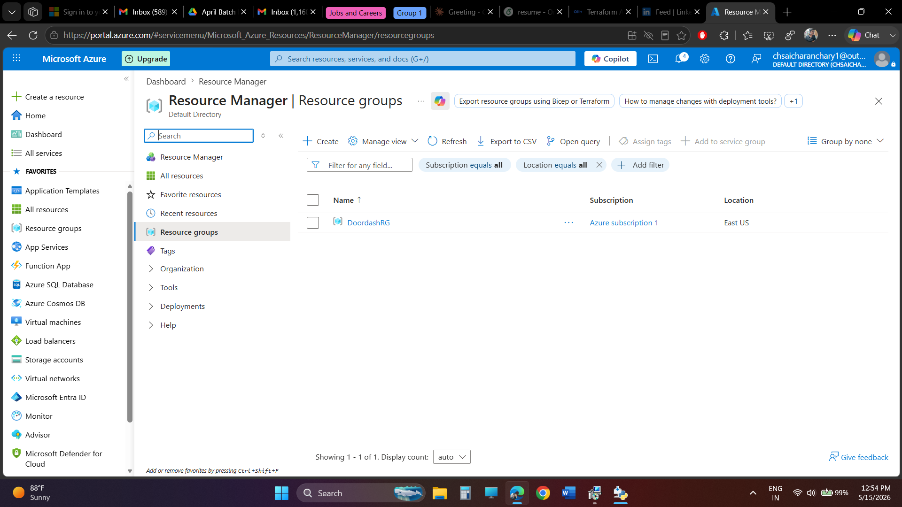
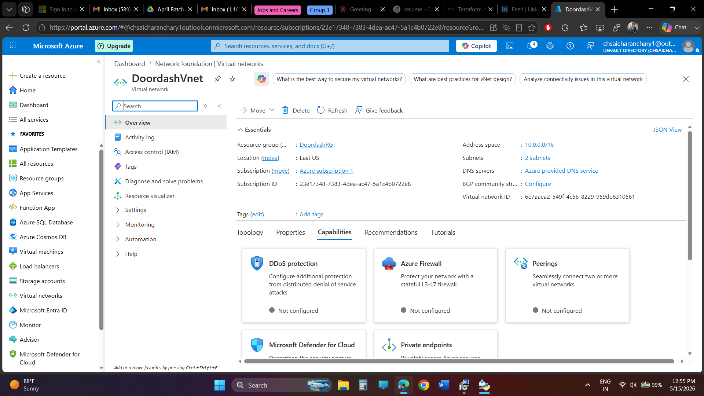
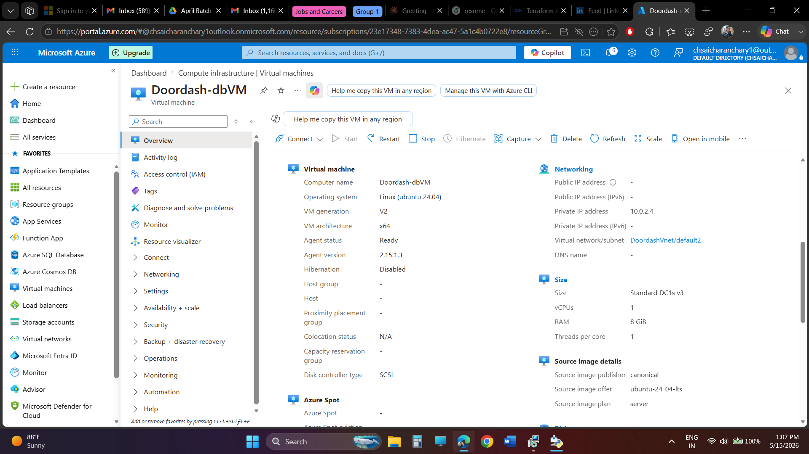
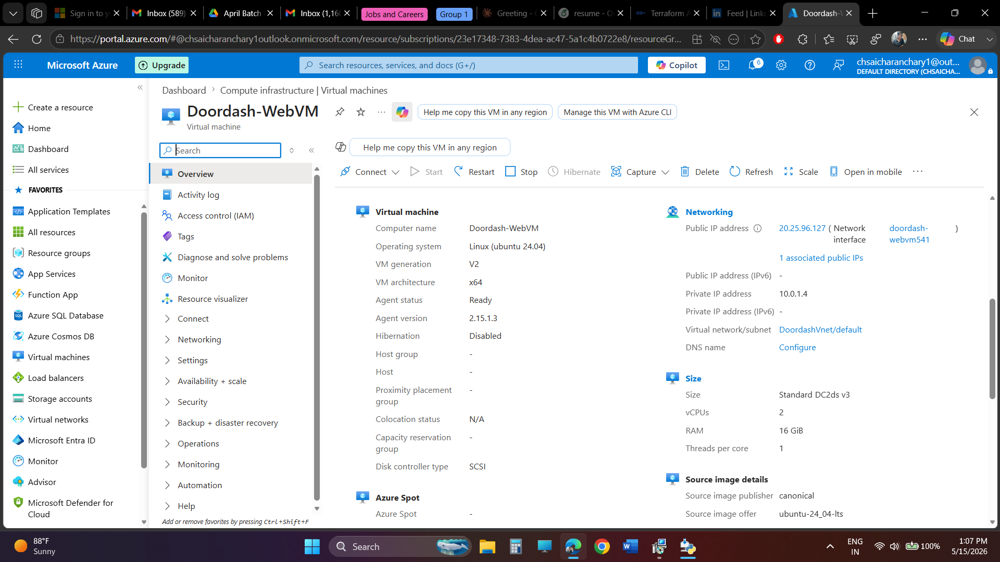
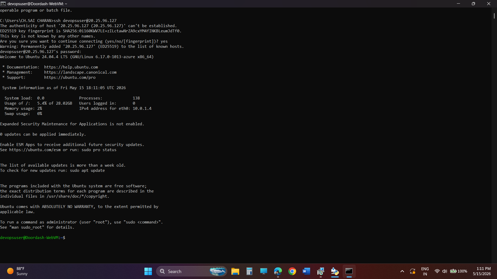
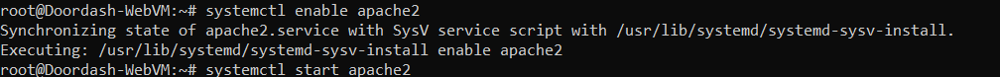
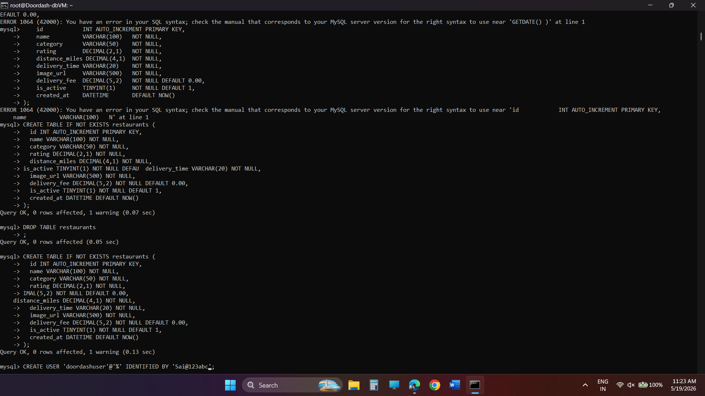
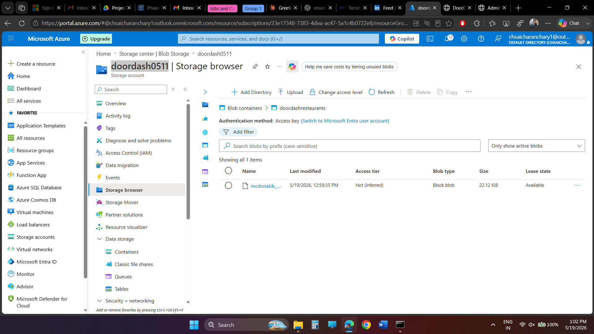
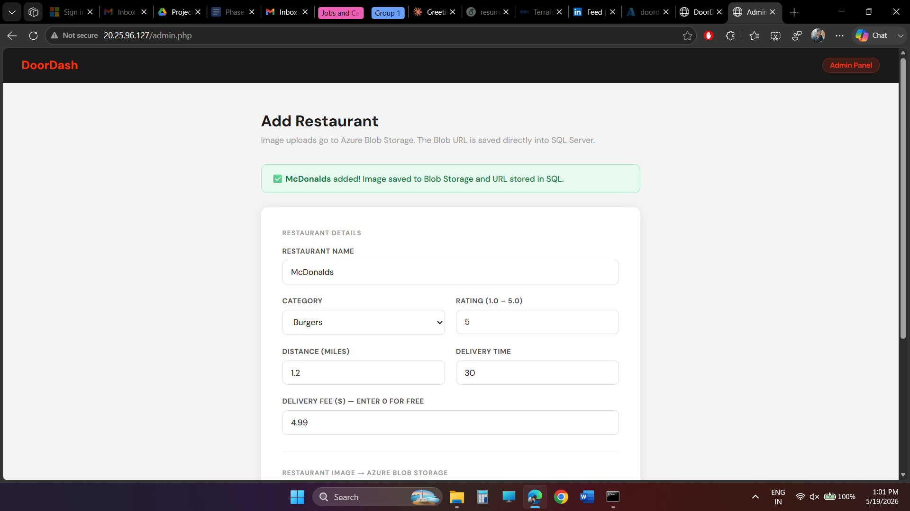
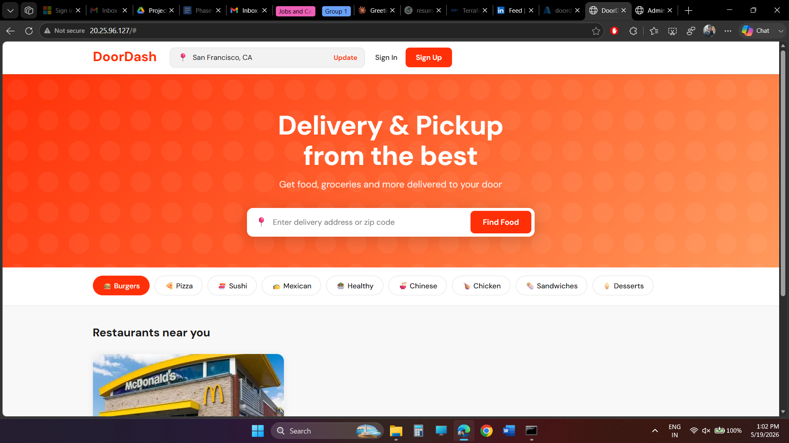

# DoorDash Clone - Cloud-Native 2-Tier Web Application on Azure

A fully functional DoorDash-inspired food delivery web app built as a DevOps capstone project on Microsoft Azure. Designed and deployed from scratch covering Azure networking, compute, storage, database, and dynamic web application development across 3 progressive phases.

Live Demo: http://20.25.96.127

---

## Architecture

```
User (Browser)
     |
     v
Azure Public IP (20.25.96.127)
     |
     v
Doordash-WebVM (Apache + PHP) -- Private IP: 10.0.1.4
     |
     |  [DoordashVnet - 10.0.0.0/16]
     v
Doordash-dbVM (MySQL 8) -- Private IP: 10.0.2.4 -- No Public IP
     |
     v
Azure Blob Storage (doordash0511 / doordashrestaurants)
```

---

## Azure Resources

```
Resource          Name                  Details
-----------       ---------------       ----------------------------------
Resource Group    DoordashRG            East US
Virtual Network   DoordashVnet          10.0.0.0/16 - 2 subnets
Web VM            Doordash-WebVM        Ubuntu 24.04, Public IP: 20.25.96.127
DB VM             Doordash-dbVM         Ubuntu 24.04, No Public IP
Storage Account   doordash0511          Blob Storage
Blob Container    doordashrestaurants   Public read access
```

---

## Phases

### Phase I - Network Foundation and Web Server Setup

- Created Resource Group (DoordashRG) in East US
- Created Virtual Network (DoordashVnet) with address space 10.0.0.0/16 and 2 subnets
- Configured NSG rules - HTTP port 80 open to internet, SSH port 22 restricted to admin IP only
- Deployed Doordash-WebVM (Ubuntu 24.04, Standard DC2ds v3) with Public IP 20.25.96.127
- Installed and configured Apache2 web server
- Validated connectivity by hosting a static HTML page

### Phase II - Dynamic 2-Tier Application (PHP + MySQL)

- Deployed Doordash-dbVM (Ubuntu 24.04, Standard DC1s v3) with no public IP - isolated inside the VNet at 10.0.2.4
- Installed MySQL 8 on the DB VM, opened port 3306 only to VirtualNetwork traffic via NSG
- Changed bind-address from 127.0.0.1 to 0.0.0.0 to allow VNet-internal connections
- Created database doordash_db, table restaurants, and user doordashuser with full privileges
- Installed PHP and php-curl on the Web VM and connected it to MySQL over private VNet using PDO
- Built db.php for centralized DB connection, index.php for the dynamic homepage, and admin.php for the admin panel

### Phase III - Azure Blob Storage Integration

- Created Storage Account (doordash0511) and Blob container (doordashrestaurants) with public read access
- Modified admin.php to upload restaurant images directly to Azure Blob Storage using the REST API with Storage Account Key authentication (no SDK required)
- Stored the full Blob URL in the image_url column of MySQL - no local image storage needed
- index.php renders images directly from Blob Storage URLs fetched from the DB

---

## File Structure

```
/var/www/html/
|-- index.php        (DoorDash clone homepage)
|-- admin.php        (Admin panel - Blob upload + DB insert)
|-- db.php           (MySQL PDO connection to DB VM)
|-- style.css        (Frontend styling)
```

---

## Key Implementation Details

### Network Security

- DB VM has zero public internet exposure - private IP 10.0.2.4 only
- NSG rule: port 3306 open to VirtualNetwork tag only
- SSH locked to admin IP, HTTP open on port 80

### Database Schema

```sql
CREATE TABLE restaurants (
  id            INT AUTO_INCREMENT PRIMARY KEY,
  name          VARCHAR(100) NOT NULL,
  category      VARCHAR(50) NOT NULL,
  rating        DECIMAL(2,1) NOT NULL,
  distance_miles DECIMAL(4,1) NOT NULL,
  delivery_time VARCHAR(20) NOT NULL,
  image_url     VARCHAR(500) NOT NULL,
  delivery_fee  DECIMAL(5,2) NOT NULL DEFAULT 0.00,
  is_active     TINYINT(1) NOT NULL DEFAULT 1,
  created_at    DATETIME DEFAULT NOW()
);
```

### Blob Upload Flow

```
1. Admin fills form and selects image
2. PHP reads image file
3. cURL PUT request to Azure Blob REST API (Storage Account Key auth)
4. Blob URL saved to MySQL image_url column
5. index.php renders image from Blob URL
```

### DB Connection

```php
$pdo = new PDO("mysql:host=10.0.2.4;dbname=doordash_db;charset=utf8mb4",
               "doordashuser", "password");
```

---

## Screenshots

### Resource Group - DoordashRG


### Virtual Network - DoordashVnet


### Web VM - Doordash-WebVM


### DB VM - Doordash-dbVM


### SSH into Web VM


### Apache Setup


### MySQL Setup on DB VM


### Azure Blob Storage


### Admin Panel


### DoorDash Clone - Live


---

## Tech Stack

```
Layer             Technology
-----------       ----------------------------------
Cloud             Microsoft Azure
OS                Ubuntu 24.04 LTS
Web Server        Apache2
Backend           PHP 8 + php-curl
Database          MySQL 8
Image Storage     Azure Blob Storage
Networking        Azure VNet, NSG, Public IP
```

---

## How to Deploy

```bash
# 1. DB VM - setup MySQL
sudo apt install mysql-server -y
sudo nano /etc/mysql/mysql.conf.d/mysqld.cnf
# set bind-address = 0.0.0.0
sudo systemctl restart mysql

# 2. Web VM - install Apache and PHP
sudo apt install apache2 php libapache2-mod-php php-mysql php-curl -y
sudo systemctl restart apache2

# 3. Copy files to web root
scp index.php admin.php db.php style.css devopsuser@20.25.96.127:/var/www/html/

# 4. Update db.php with DB VM private IP and credentials
# 5. Update admin.php with Azure Storage Account name and Key
```

---

GitHub: https://github.com/Saicharan-Chintapatla/Doordash-Azure-TwoTier
